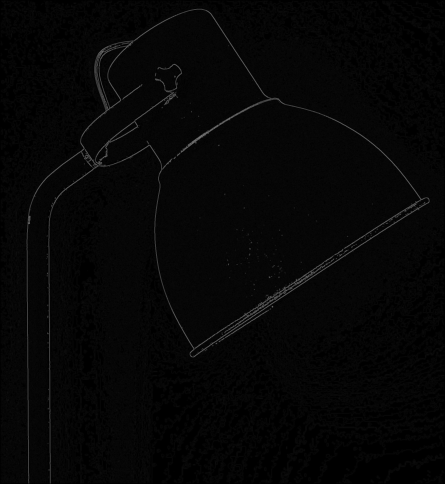

# Canny Edge Detection with NumPy

This repository contains a Python script for implementing Canny edge detection primarily using native code with a strong emphasis on NumPy for efficient data manipulation. OpenCV is used exclusively for image loading and saving.

## Overview

Canny edge detection is an image processing technique that aims to detect edges or boundaries within an image. It involves several steps to identify and highlight the areas in an image where pixel intensity changes rapidly.

## Steps to Reproduce Canny Edge Detection

Follow these steps to reproduce Canny edge detection using the provided Python script:

### Step 1: Load an Image

The script loads an image from the disk using the `load_image` function. You can replace "01-image.jpg" in the function call with your own image file. This is the starting point for edge detection.

**Original Image:** You can replace this image with your own.


### Step 2: Convert to Gray-Scale

The loaded image is converted to gray-scale using the `rgb_to_gray_scale` function. Gray-scaling simplifies the image to a single channel, making edge detection more effective. The gray-scale image is saved as "02-gray-scale.jpg."


### Step 3: Remove Noise

To remove noise and smooth the image, a Gaussian kernel with a kernel size of 5 and a sigma of 1 is used. The `gaussian_kernel` function generates this 5x5 Gaussian kernel. The kernel is normalized to ensure that the sum of all its values equals 1, preserving image brightness. The noise-removed image is saved as "03-noise-removed.jpg."


### Step 4: Estimate Gradient Strength and Direction

To estimate the gradient strength and direction within the image, the script uses two convolution kernels. The first kernel `Mx` calculates the horizontal gradient, and the second kernel `My` calculates the vertical gradient. These kernels are Sobel filters.

```python
Mx = np.array([[-1, 0, 1], [-1, 0, 1], [-1, 0, 1]], dtype=np.float32)
My = np.array([[1, 1, 1], [0, 0, 0], [-1, -1, -1]], dtype=np.float32)
```

The `convolution_2d_with_zero_padding` function is used to apply these kernels to the image. This function performs a 2D convolution with zero padding, allowing the kernels to traverse the entire image. It calculates the convolution between the image and the given kernel, producing an output image. The initial edge image is saved as "04-initial-edge.jpg."


### Step 5: Ensure One-Pixel Thick Edges

To ensure that the detected edges are one pixel thick, non-maximum suppression is performed. This step retains only the maximum gradient pixels along the edge direction normal to the gradient. The one-pixel thick edge image is saved as "05-one-px-thick-edge.jpg."


### Step 6: Apply Double Threshold

Double thresholding is applied to link edge maximum gradient pixels and suppress weak edges. Strong edges are highlighted, while weak edges are removed. The final Canny edge image is saved as "06-canny-edge.jpg."



## Additional Note: Convolution with Zero Padding

The `convolution_2d_with_zero_padding` function performs a 2D convolution with zero padding, allowing the convolution kernels to traverse the entire image. The zero padding ensures that the output image is of the same size as the input image. The kernel is flipped and applied to different regions of the image to calculate the convolution at each pixel.

## Using Your Own Image

Feel free to use this repository to explore and understand Canny edge detection with NumPy and native code. You can replace the input image with your own and follow the steps to apply Canny edge detection to your data.

## Running the Script

To run the script, ensure you have the required packages installed by using the `requirements.txt` file. Use the following command to run the script:

```bash
python script.py
```
